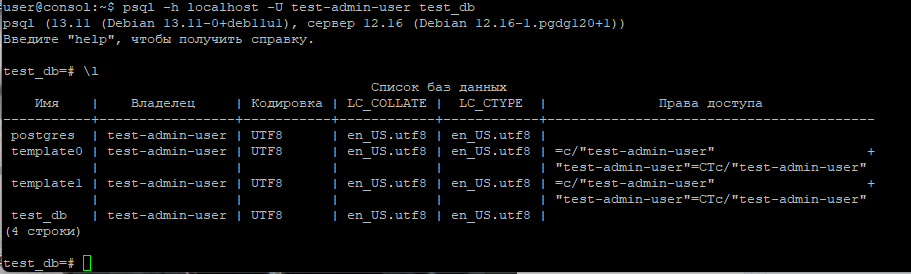

# Домашнее задание к занятию 2. «SQL» - Рыбакин Алексей

## Задача 1

Используя Docker, поднимите инстанс PostgreSQL (версию 12) c 2 volume, 
в который будут складываться данные БД и бэкапы.

Приведите получившуюся команду или docker-compose-манифест.

<details>
<summary> docker-compose.yaml </summary>

```
version: '3'

volumes:
  data: {}
  backup: {}

services:

  postgres:
    image: postgres:12
    container_name: psql-rae
    ports:
      - "0.0.0.0:5432:5432"
    volumes:
      - data:/var/lib/postgresql/data
      - backup:/media/postgresql/backup
    environment:
      POSTGRES_USER: "test-admin-user"
      POSTGRES_PASSWORD: "netology"
      POSTGRES_DB: "test_db"
    networks:
      network-rae:
        ipv4_address: 172.19.0.2
    restart: always

  pgadmin:
    image: dpage/pgadmin4
    container_name: pgadmin-rae
    environment:
      PGADMIN_DEFAULT_EMAIL: rae@mymail.me
      PGADMIN_DEFAULT_PASSWORD: 123
    ports:
      - "8080:80"
    networks:
      network-rae:
        ipv4_address: 172.19.0.3
    restart: always

networks:
  network-rae:
    driver: bridge
    ipam:
      config:
      - subnet: 172.19.0.1/24
```

</details>



## Задача 2

В БД из задачи 1: 

- создайте пользователя test-admin-user и БД test_db;
- в БД test_db создайте таблицу orders и clients (спeцификация таблиц ниже);
- предоставьте привилегии на все операции пользователю test-admin-user на таблицы БД test_db;
- создайте пользователя test-simple-user;
- предоставьте пользователю test-simple-user права на SELECT/INSERT/UPDATE/DELETE этих таблиц БД test_db.

Таблица orders:

- id (serial primary key);
- наименование (string);
- цена (integer).

Таблица clients:

- id (serial primary key);
- фамилия (string);
- страна проживания (string, index);
- заказ (foreign key orders).

Приведите:

- итоговый список БД после выполнения пунктов выше;
- описание таблиц (describe);
- SQL-запрос для выдачи списка пользователей с правами над таблицами test_db;
- список пользователей с правами над таблицами test_db.

<details>
<summary> Ответ 2: </summary>

'''
CREATE TABLE clients
(
    Id SERIAL PRIMARY KEY,
    наименования varchar(200) not null
    цена varchar(200) notnull,
);

CREATE TABLE Orders
(
    Id SERIAL PRIMARY KEY,
    фамилия varchar(200) not null,
    страна_проживания varchar(200) not null,
    заказ INTEGER REFERENCES client (Id)
);

'''

</details>

## Задача 3

Используя SQL-синтаксис, наполните таблицы следующими тестовыми данными:

Таблица orders

|Наименование|цена|
|------------|----|
|Шоколад| 10 |
|Принтер| 3000 |
|Книга| 500 |
|Монитор| 7000|
|Гитара| 4000|

Таблица clients

|ФИО|Страна проживания|
|------------|----|
|Иванов Иван Иванович| USA |
|Петров Петр Петрович| Canada |
|Иоганн Себастьян Бах| Japan |
|Ронни Джеймс Дио| Russia|
|Ritchie Blackmore| Russia|

Используя SQL-синтаксис:
- вычислите количество записей для каждой таблицы.

Приведите в ответе:

    - запросы,
    - результаты их выполнения.

<details>
<summary> Ответ 3: </summary>

</details>

## Задача 4

Часть пользователей из таблицы clients решили оформить заказы из таблицы orders.

Используя foreign keys, свяжите записи из таблиц, согласно таблице:

|ФИО|Заказ|
|------------|----|
|Иванов Иван Иванович| Книга |
|Петров Петр Петрович| Монитор |
|Иоганн Себастьян Бах| Гитара |

Приведите SQL-запросы для выполнения этих операций.

Приведите SQL-запрос для выдачи всех пользователей, которые совершили заказ, а также вывод этого запроса.
 
Подсказка: используйте директиву `UPDATE`.

<details>
<summary> Ответ 4: </summary>

</details>

## Задача 5

Получите полную информацию по выполнению запроса выдачи всех пользователей из задачи 4 
(используя директиву EXPLAIN).

Приведите получившийся результат и объясните, что значат полученные значения.

<details>
<summary> Ответ 5: </summary>

</details>

## Задача 6

Создайте бэкап БД test_db и поместите его в volume, предназначенный для бэкапов (см. задачу 1).

Остановите контейнер с PostgreSQL, но не удаляйте volumes.

Поднимите новый пустой контейнер с PostgreSQL.

Восстановите БД test_db в новом контейнере.

Приведите список операций, который вы применяли для бэкапа данных и восстановления. 

<details>
<summary> Ответ 6: </summary>

</details>
